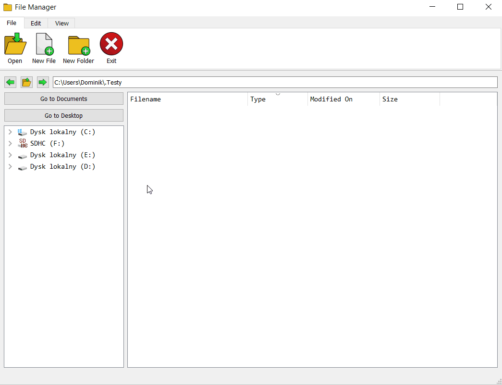
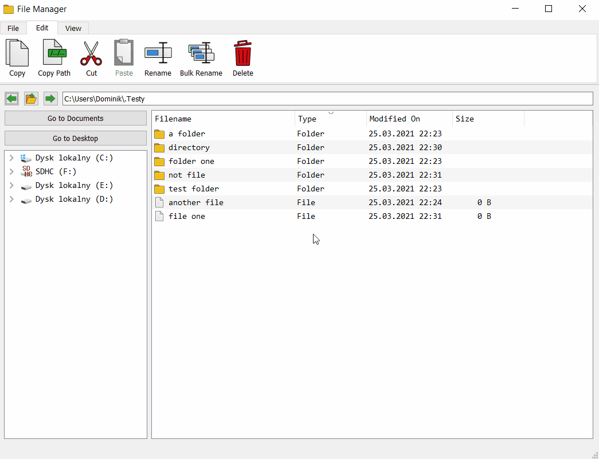
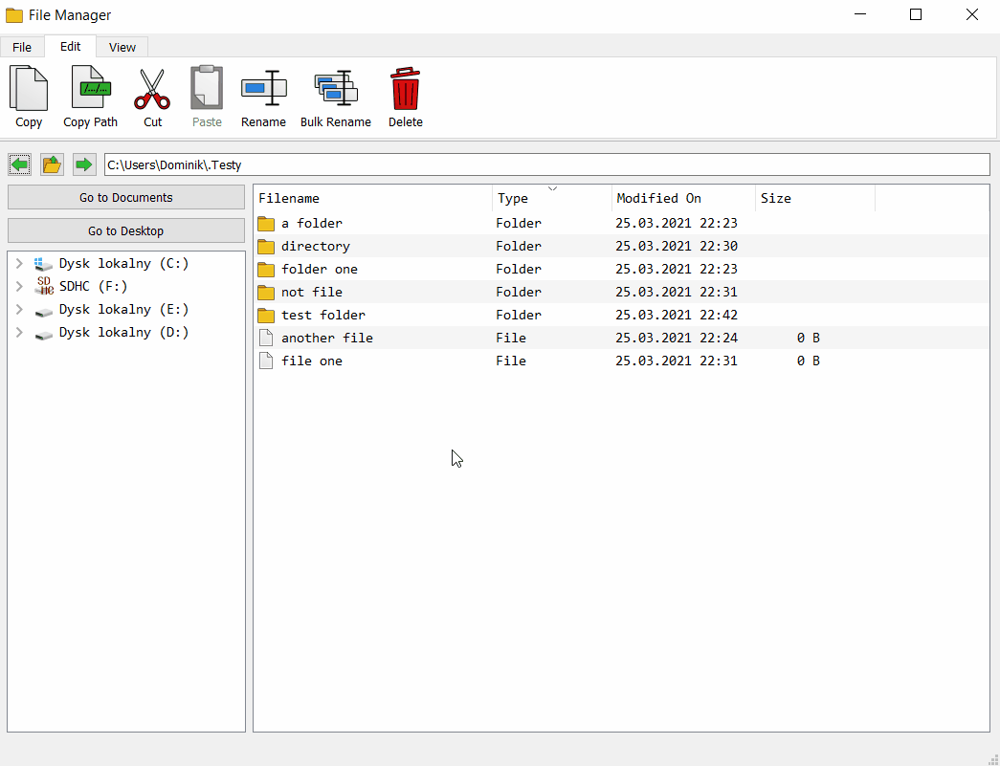
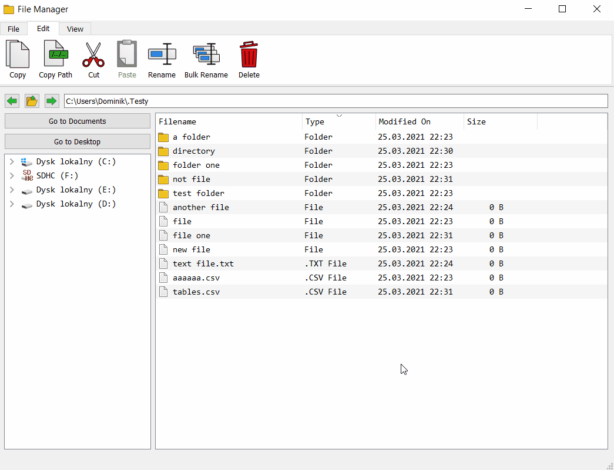
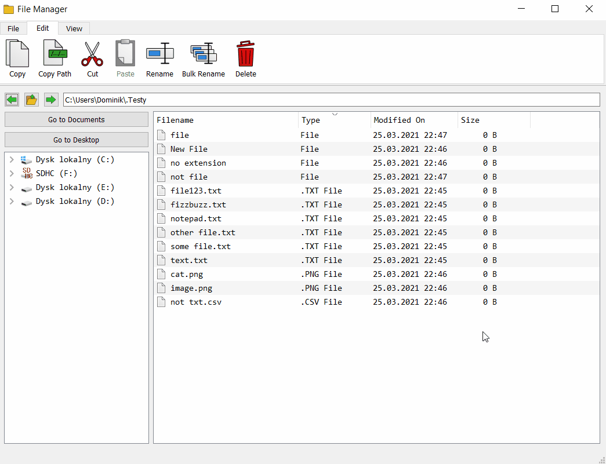
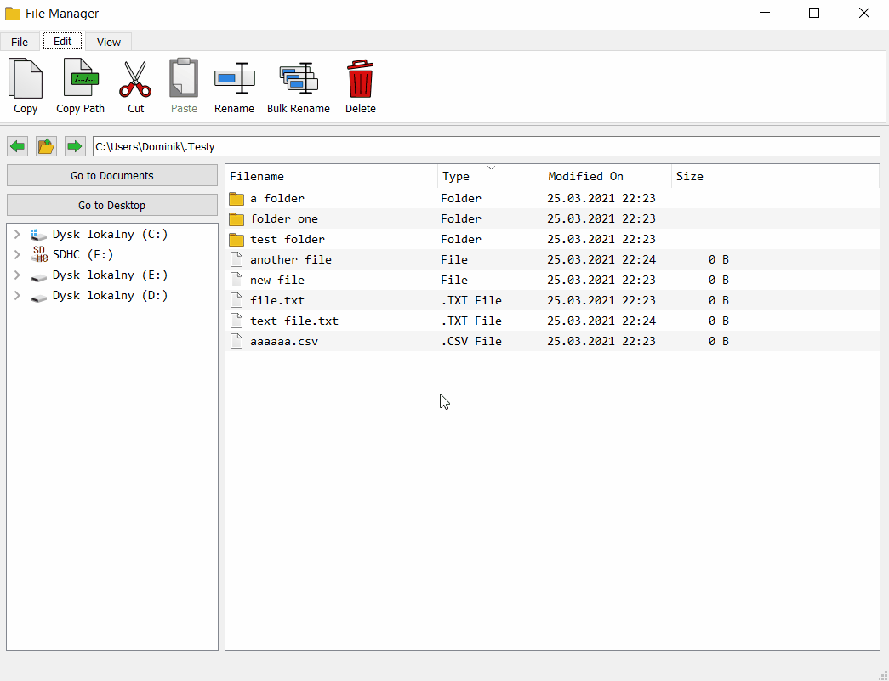
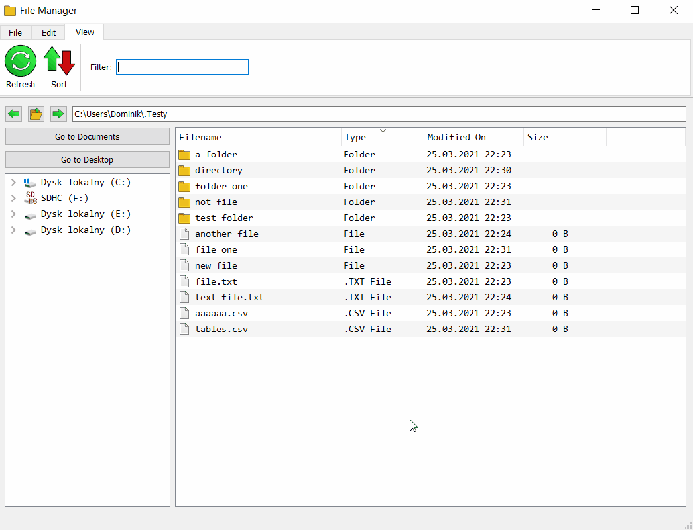
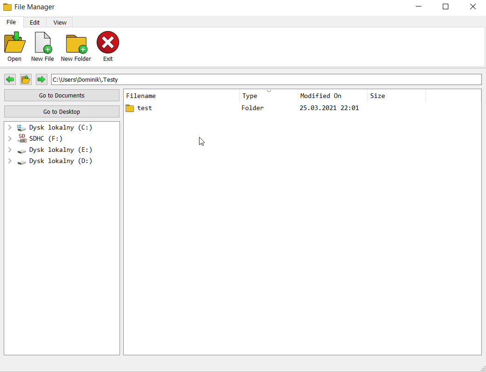
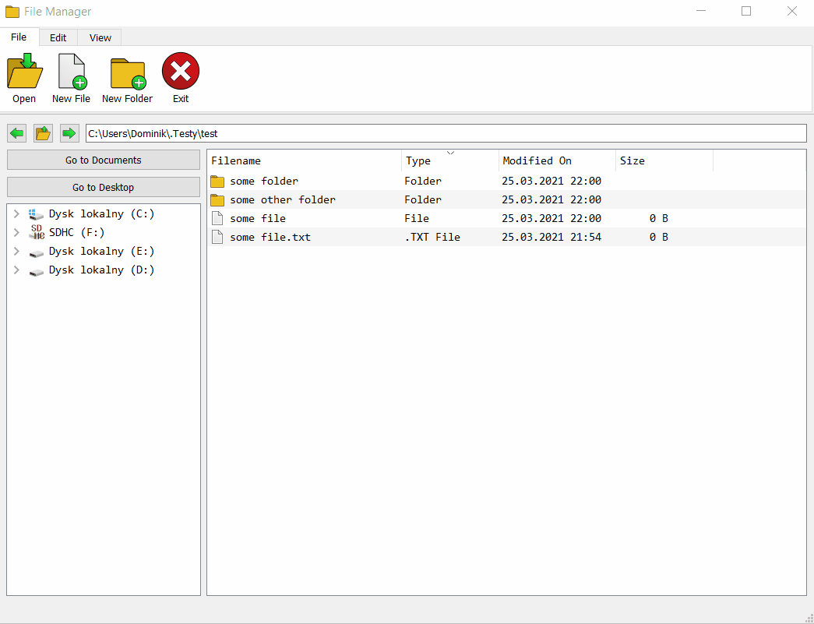

# file-manager
Simple file manager built with PyQt5. Python 3.8.3.

# Main Features
- creating new files and directories
- navigation: step back, step forward and directory up
- copy, copy as path, cut, paste, rename, delete
- bulk renamer for files
- sorting by chosen column
- filtering files and directories4
- drag and drop mode for moving files

### Directory creating

### Copying files

### Copying path

### Cutting files

### Renaming and deleting

### Bulk rename

### Sorting

### Filtering

### Navigation through directories

### Drag and drop

